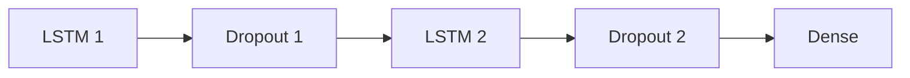
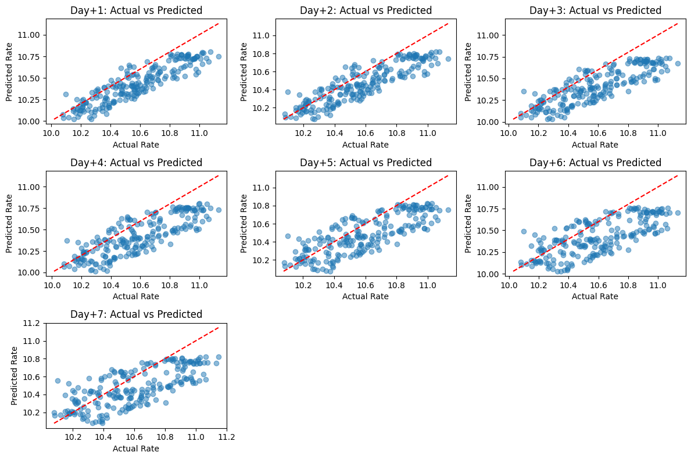

# ID2223 Final Project

HT24 - Group 4\
Leon Braszczynski and Arun Chandanaveli\
`leonbr`,`arunc@kth.se`

# Predicting Swedish Krona (SEK) forex rate

## Introduction

This project aims to develop a robust machine learning model to forecast the exchange rate of the Swedish Krona (SEK)
against United States Dollars (USD). Accurate predictions of exchange rates are crucial for financial institutions,
businesses, and investors to make informed decisions regarding currency trading, hedging strategies, and international
transactions.

This project leverages historical financial data, including a few economic indicators and market
indices, to train and validate a Long Short-Term Memory (LSTM) neural network model. The model is designed to predict
the exchange rate for upto the next seven days, providing valuable insights into future currency movements. By utilizing
hyperparameter tuning and sequence modeling, this project aims to achieve high prediction accuracy and reliability. The
results are visualized using a [static dashboard](https://aruncveli.github.io/id2223-project/) hosted at GitHub pages,
intending to offer a comprehensive view of the generated insights.

## Data

A lot of factors can influence the exchange rate of a currency, which makes it a challenging task to predict. Even if
they can change every day every so slightly, their changes are not published every day, like the central bank interest
rates, inflation, and GDP growth. So, we intend to take a broader approach to pick the data that can be fetched daily
and can have a potential impact on the exchange rate, namely:

1. [CBOE Volatility Index](https://www.cboe.com/tradable_products/vix/) (VIX): Ticker symbol from the Chicago Board
   Options Exchange's CBOE Volatility Index, a popular measure of the stock market's expectation of volatility based on
   S&P 500 index options. Since the exchange rate is against USD.
2. [OMX Stockholm 30](https://www.nasdaq.com/european-market-activity/indexes/omxs30) (OMX): Index of the 30 most-traded
   stock on the Nasdaq Stockholm stock exchange. Since the most prominent stock index in Sweden.
3. [Brent Index](https://www.ice.com/futures-europe/brent) (BZ=F): Specifically Brent Last Day Financial Futures, a
   derivative product based on the crude oil
   production from the North Sea (Northwest Europe). Since it is the geographically nearest index which can affect
   Sweden's oil price.

All the data is fetched from [Yahoo Finance](https://finance.yahoo.com/) using [
`yfinance`](https://ranaroussi.github.io/yfinance/index.html) library.

## Methodology

### Backfilling

Around 15 years of historical data (from 2010-01-01), approximately 3000 instances, were fetched from Yahoo Finance for
each of the above indicators.
Only the Close prices of each day of trade was considered as features. So, for each indicator, an effective time series
with one feature was created and saved into Hopsworks as feature groups.

### Feature pipeline

Every day at 20:00 UTC, the latest available Close prices are fetched from Yahoo Finance and saved into the respective
Hopsworks feature groups. The
pipeline was implemented as a Python script and orchestrated using GitHub Actions with the Hopsworks Python SDK.

### Training

The data from the four feature groups was combined into a single feature view, joining the tables by primary key `date`.

For employing some cross validation, the data was split into subsets as follows:

* Training: 2010-2022
* Validation: 2022-2023
* Test: 2023-2024

For each datapoint, a 30-day window of historical data was considered as the sequence to train/validate/predict.

Since we planned to model this as a time series forecasting problem, we chose to employ
a [Keras powered LSTM neural network](https://keras.io/api/layers/recurrent_layers/lstm/) as the algorithm. Cascading
multiple LSTM layers using the Keras API, the final
architecture schematic looks like this:

The following hyperparameters:

* The units (dimension of the output space) of the both LSTM layers
* Dropout rates of both the dropout layers
* The learning rate of the model's Adam optimizer

were [tuned using random search](https://keras.io/keras_tuner/api/tuners/random/). Since we were trying to predict the
rates upto one week in advance, the Dense layer had 7 units, one for each day.

A scatterplot of the actual vs predicted values in the test set is shown below:

The trained model was then uploaded to Hopsworks Model Registry for inference.

Even though the [training notebook](train_model_7daysV2_all.ipynb) is self-contained without any known side effects, it
was not scheduled to run
periodically as the feature or inference
pipelines. We would like to clarify that there were no technical issues with
creating such a pipeline, but decided to down prioritize it due to the lesser value it provides for the closer
deadline of the project.

### Inference

An inference pipeline, implemented similar to the feature pipeline, runs every day at 21:00 UTC, cutting some slack for
the Hopsworks free tier limits.

After downloading the model from Hopsworks and initializing it, the latest 30 days of data is fetched from the feature
group and fed into the model to predict the next 7 days of exchange rates. The predictions for the next day and the 7th
day are saved back into respective feature groups in Hopsworks, for visualization purposes.

Generated plots are saved as images into the [`docs`](docs) directory as part of the inference pipeline. This will then
trigger the GitHub pages deployment pipeline.
